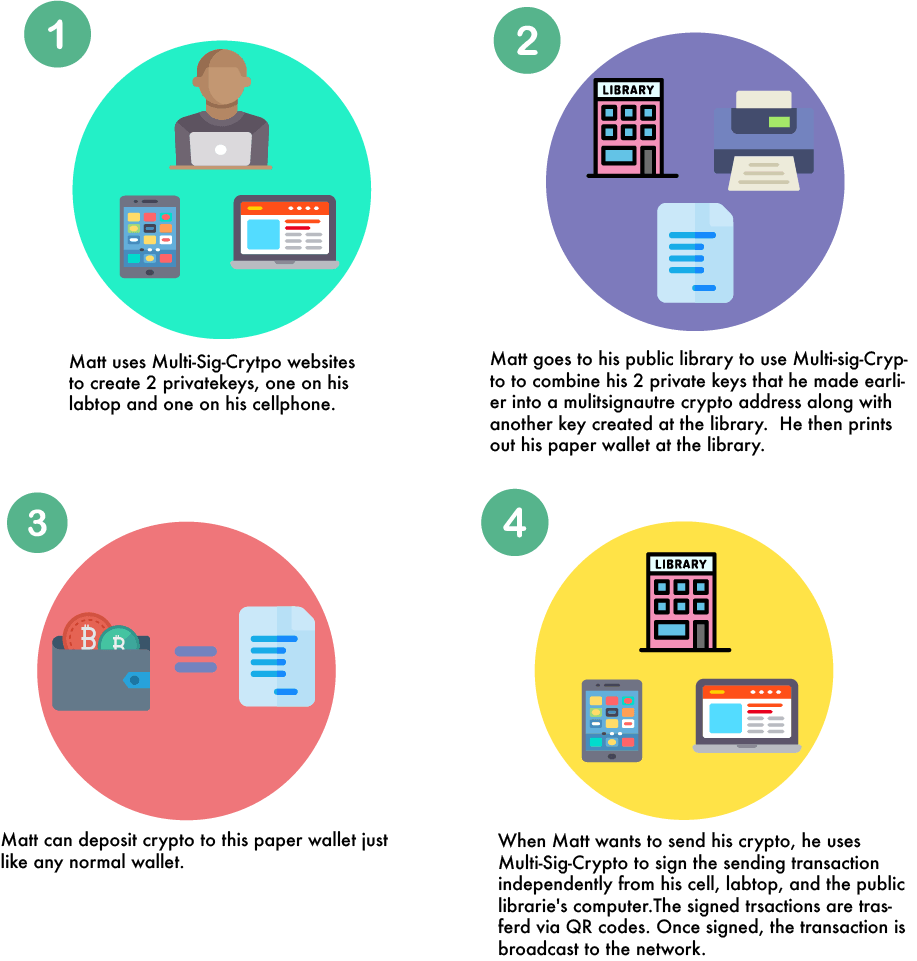

# [Sponsors](https://github.com/DecentralizeJustice/MultiSigCrypto#sponsors-1)             

Multi-Sig-Crypto is an open source project by Decentralized Justice made possible by these wonderful supporters:
 

Justis Allen

# Multi-Sig-Crypto            

Mutli-Sig-Crypto is a web wallet that is secured through decentralized methods using a combination of paper wallets, cellphones, hardware wallets, and computers along with browser side Javascript. 

## How It Works
Multi-Sig-Crypto allows for several approaches to using web wallets securely, but here we will outline one example that demonstrates the underlying principles of our project: 

Matt creates his keys on several devices, and this method is so secure that he can safely use a public printer and computer to print his wallet. A hacker would have to hack Matt's phone, labtop, and the public computer that he used to create the wallet if they wanted to steal Matt's private keys. 

## Advantages
- Decentralized Protection      
	The fact that your keys are distributed over several systems makes it extremely difficult for a single hacker to attain all of the private keys needed to steal your Crypto. The chances of a key theft can be further decreased by including a offline generated paper wallet in your private key group and other methods.
* Accessible 	   	   
	Multi-Sig-Crypto only requires that you have access to internet to create your secure addresses. It uses no specific hardware, but due to its decentralized nature your private keys can still be secured. 
* Secure from Offline Lost and Theft      
	Multi-Sig-Crypto's 3 ket standard allows you to [split up](https://en.wikipedia.org/wiki/Secret_sharing) and back up in your keys in a way that is simple and redundant to lost or theft. 
* Simple     
	Multi-Sig-Crypto runs in browser, thus requiring no software downloads. MSC also dose not use any frameworks and keeps dependencies  to a bare minimum. This servers to encourage code review and Open-Source contributions by having a low learning and adoption curve. 
	
## Open Source Community 
Multi-Sig-Crypto aims to foster a community that is open, welcoming, and easy to join. MSC hopes to be the change that we want to see in the crypto space. If you have any questions about why we did something or a more technical aspect, checkout our wiki.
If you have any general questions open up an issue on our github, make a post on our reddit, or shoot us a email @.... All engagement is appreciated and valued.

## Sponsors              
- Justis Allen  
 Critical Resistance organizer, minimalist, runner, and barefoot and music enthusiast